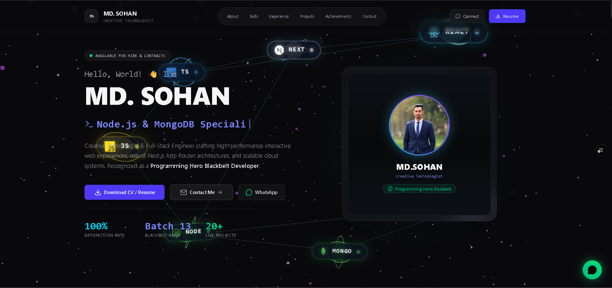

<div align="center">

# 🌌 MD. SOHAN — 3D Interactive Developer Portfolio

<p align="center">
  <strong>A futuristic, high-performance 3D developer portfolio crafted with Next.js 16, TypeScript, Three.js, Framer Motion & Tailwind CSS.</strong>
</p>

[](https://3-d-protfolio-liard.vercel.app/)
[](https://nextjs.org/)
[](https://react.dev/)
[](https://www.typescriptlang.org/)
[](https://threejs.org/)
[](https://tailwindcss.com/)
[](LICENSE)

<br />

<a href="https://3-d-protfolio-liard.vercel.app/">
  
</a>

<br /><br />

[🌐 Explore Live Portfolio](https://3-d-protfolio-liard.vercel.app/) • [📄 Download Resume](https://drive.google.com/uc?export=download&id=1gg2hVewdNubgbXD7JEXdMLieLW3hXG0s) • [💼 LinkedIn Profile](https://www.linkedin.com/in/sohanislamwebdev/) • [📬 Get in Touch](mailto:islammdsohan603@gmail.com)

</div>

---

## 📖 Overview

Welcome to the official repository of **MD. SOHAN's 3D Interactive Portfolio**. 

This web application represents a fusion between modern full-stack web engineering and creative 3D web design. Built to demonstrate high technical standards, it features an interactive **antigravity particle universe**, real-time **3D card tilt physics**, responsive **Bento Grid architecture**, automated **full-stack contact dispatching with MongoDB**, and fluid **60fps micro-animations**.

> **"Dedicated Full-Stack Web Developer combining modern Next.js architecture, robust backend APIs, and futuristic 3D creative user experiences."**

---

## ✨ Key Highlights & Features

### 🌌 1. Immersive 3D Antigravity Canvas
* Powered by **Three.js** & **@react-three/fiber**.
* Interactive geometric particles reacting to cursor motion, scroll triggers, and viewport dimensions.
* Lightweight, optimized render loop maintaining 60fps on both desktop and mobile viewports.

### 🍱 2. Tech Radar & Bento Grid Matrix
* Categorized skill visualization (**Frontend**, **Backend**, **DevOps & Cloud**, **Frontier & AI**).
* Interactive 3D orbital sphere animation and proficiency metrics.
* Dynamic filter tabs with smooth state transitions.

### 🚀 3. Production Project Showcases
* Rich project modal with deep architectural summaries, technical stack badges, and key deliverables.
* Direct access to **Live Previews** and **GitHub Repositories**.
* Featured Projects:
  * **RecipeHub** — Full-stack recipe ecosystem with Stripe subscriptions, Firebase Auth, and RBAC admin panels.
  * **Job Portal Engine** — High-concurrency recruitment platform with applicant pipelines and resume tracking.
  * **Programming Courses Platform** — Interactive developer learning platform with instant curriculum searching.
  * **Doctor Appointment Manager** — Medical booking engine featuring collision-detection scheduling algorithms.

### 🏆 4. Verified Honors & Credentials
* Interactive credential cards featuring **Programming Hero BLACKBELT Developer** (Batch 13).
* Certificate inspection modal displaying official credential IDs and covered competencies.

### 📬 5. Full-Stack Contact Engine & Confetti FX
* Reactive contact form integrated with Express REST API, MongoDB document storage, and Nodemailer instant email notifications.
* Celebratory dynamic canvas confetti upon verified transmission.
* Resilient fallback handling for seamless client-side feedback.

### 📱 6. Cyberpunk Glassmorphic Design System
* High-contrast obsidian dark mode palette (`#090d16`, `#00f2fe`, `#6366f1`).
* Mobile-responsive navigation drawer with smooth backdrop blur.
* Floating WhatsApp direct-chat button with micro-pulse indicator.

---

## 🛠️ Built With

### Frontend & Creative Engine
| Technology | Role |
| :--- | :--- |
| **Next.js 16 (App Router)** | Modern React framework with Server Components & SSG/SSR |
| **React 19** | Core UI library with concurrent rendering |
| **TypeScript** | Strict compile-time type safety across all components |
| **Three.js & R3F** | 3D web graphics, shaders, and particle physics |
| **Tailwind CSS v4** | Utility-first styling with custom glassmorphism design tokens |
| **Framer Motion & GSAP** | High-fidelity scroll animations and modal transitions |
| **Lucide React & React Icons** | Modern, lightweight iconography |
| **Canvas Confetti** | Celebratory micro-interaction animations |

### Backend & Infrastructure
| Technology | Role |
| :--- | :--- |
| **Node.js & Express.js** | RESTful API server handling contact pipeline |
| **MongoDB Atlas & Mongoose** | Cloud NoSQL database storing client inquiries |
| **Nodemailer** | SMTP notification engine delivering automated alert emails |
| **Vercel** | Serverless edge deployment for frontend and backend |

---

## 📁 Architecture & Directory Structure

```plaintext
protfolio/
├── public/                     # Static assets, badges, certificate & screenshots
│   ├── blackbelt.png           # Programming Hero Blackbelt badge
│   ├── cartificat.png          # Official completion certificate
│   ├── protfolio.png           # High-resolution portfolio preview banner
│   └── sohanimage.png          # Developer profile photograph
├── src/
│   ├── app/                    # Next.js 16 App Router pages & root layout
│   │   ├── favicon.ico
│   │   ├── globals.css         # Custom glassmorphic utilities & animations
│   │   ├── layout.tsx          # Root layout with metadata and SEO
│   │   └── page.tsx            # Main single-page portfolio assembly
│   ├── components/             # Reusable UI component modules
│   │   ├── About.tsx           # Biography narrative & 3D tilt stat cards
│   │   ├── Achievements.tsx    # Awards, certifications & credential modal
│   │   ├── Contact.tsx         # Full-stack contact form with live validation
│   │   ├── FloatingWhatsApp.tsx# Quick-connect floating action button
│   │   ├── Footer.tsx          # Clean footer with smooth scroll-to-top
│   │   ├── Hero.tsx            # Hero section with role typewriter & CTAs
│   │   ├── Navbar.tsx          # Sticky glassmorphic navbar with mobile drawer
│   │   ├── Projects.tsx        # Project showcase gallery & modal system
│   │   ├── canvas/             # Three.js 3D Antigravity particle scene
│   │   │   ├── AntigravityCanvasWrapper.tsx
│   │   │   └── AntigravityScene.tsx
│   │   ├── db/                 # Local data models & JSON catalogs
│   │   │   └── projects.json
│   │   ├── experience/         # Experience timeline & current development
│   │   ├── tech/               # Skills bento grid, radar & 3D orbital sphere
│   │   └── ui/                 # ScrollReveal wrappers & modal atoms
├── .env                        # Environment configurations
├── next.config.ts              # Next.js compiler & image remote patterns
├── package.json                # Project dependencies and script scripts
└── tsconfig.json               # TypeScript strict configuration
```

---

## 🚀 Getting Started Locally

Follow these steps to run the portfolio locally on your machine:

### Prerequisites
* **Node.js**: `v18.17.0` or higher installed
* **npm**, **yarn**, or **pnpm** package manager
* **Git** installed

### 1. Clone the Repository
```bash
git clone https://github.com/islammdsohan603/TypescriptProtfolio.git
cd TypescriptProtfolio/protfolio
```

### 2. Install Dependencies
```bash
npm install
```

### 3. Setup Environment Variables
Create a `.env.local` file in the `protfolio/` directory:

```env
# Backend API Base URL
NEXT_PUBLIC_API_URL=http://localhost:5000
```

> **Note:** For full-stack contact submissions during local development, ensure your Express backend in `backend/` is also running on port `5000`.

### 4. Start the Development Server
```bash
npm run dev
```

Open [http://localhost:3000](http://localhost:3000) in your browser to explore the portfolio in real time!

---

## ⚙️ Backend Setup (Optional for Contact Form)

If you wish to test contact form submissions locally:

1. Navigate to the backend directory:
   ```bash
   cd ../backend
   npm install
   ```
2. Configure `backend/.env`:
   ```env
   PORT=5000
   MONGO_DB_URI=your_mongodb_connection_string
   CLIENT_URL=http://localhost:3000
   EMAIL_USER=your_gmail_address
   EMAIL_PASS=your_gmail_app_password
   RECEIVER_EMAIL=your_notification_email
   ```
3. Run the backend server:
   ```bash
   npm run dev
   ```

---

## 🎯 Performance & SEO Optimizations

- **Server-Side Generation (SSG)** for instantaneous first contentful paint (FCP).
- **Next.js Image Component (`next/image`)** for automatic WebP/AVIF compression and zero layout shift.
- **Dynamic Imports & Lazy Hydration** for 3D Three.js canvas components to ensure smooth initial page loads.
- **Comprehensive OpenGraph & Meta tags** for high-impact social preview cards.

---

## 👨‍💻 About MD. SOHAN

* **Location:** Dhaka, Bangladesh (Available for remote contracts worldwide)
* **Specialization:** Next.js App Router, TypeScript, MERN Stack, 3D Web Experiences
* **Honor:** Programming Hero BLACKBELT Developer (Batch 13 Top Performer)
* **Website:** [3-d-protfolio-liard.vercel.app](https://3-d-protfolio-liard.vercel.app/)
* **Email:** [islammdsohan603@gmail.com](mailto:islammdsohan603@gmail.com)
* **WhatsApp:** [+880 1849 468455](https://wa.me/8801849468455)
* **LinkedIn:** [sohanislamwebdev](https://www.linkedin.com/in/sohanislamwebdev/)
* **GitHub:** [@islammdsohan603](https://github.com/islammdsohan603)

---

## 📄 License

This project is licensed under the [MIT License](LICENSE) — you are free to use this codebase for inspiration and personal portfolio development.

<div align="center">
  <sub>Designed & Developed with ❤️ by <strong>MD. SOHAN</strong> • Powered by <strong>Next.js 16</strong> & <strong>Three.js</strong></sub>
</div>
